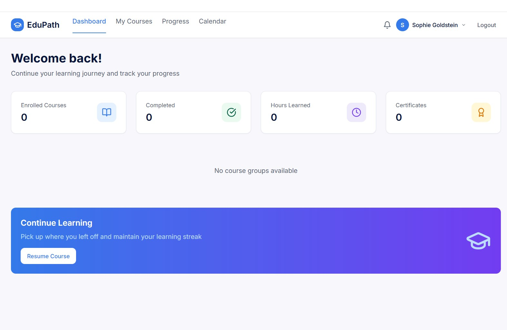

# Learning Management System (LMS)

## Overview
This project is a Learning Management System (LMS) built using Replit. It follows a server-client architecture and provides essential features for managing and tracking learning activities.

## Features
- **User Login**: Secure login system for students and educators.
- **Course Dashboard**: View assigned courses and track progress.
- **Course Selection**: Browse and enroll in available courses.
- **Progress Tracking**: Monitor completion status and learning milestones.
- **Database Integration**: Stores user data, course information, and progress records.

## Preview

Here’s a screenshot of the LMS dashboard:

## Tech Stack
- **Frontend**: HTML, CSS, JavaScript
- **Backend**: Node.js or Python (depending on implementation)
- **Database**: SQLite, JSON, or Replit DB
- **Platform**: Developed and hosted on [Replit](https://replit.com)

## Getting Started
1. Clone this repository or fork it to your Replit account.
2. Run the server file (`server.js` or `main.py`).
3. Access the client interface and log in or register.
4. Explore courses and track your progress.

## Use Cases
- Students accessing assigned learning materials
- Educators managing course content and student progress
- Self-learners browsing and selecting topics of interest

## Future Improvements
- Admin panel for course creation and management
- Role-based access control
- Enhanced UI/UX design
- Notifications and reminders

## License
This project is licensed under the GNU General Public License v3.0.  
See the LICENSE file for details.

